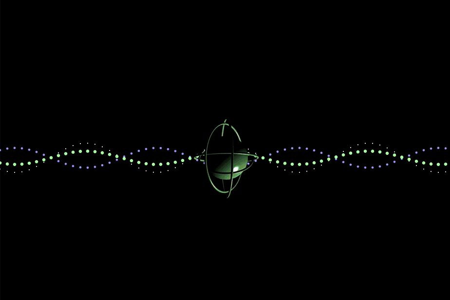

# Homework 7 - CMSC475 - Spring 2023

➤ Grace Johnson

## 1. Reflection

[*Reflection: 'Memories are like stars'*](https://editor.p5js.org/johnsongc3/sketches/yLJi1tJbk)

[Source Code](./reflection/)

Reflection was the prompt that immediately caught my attention. I found myself contemplating the various meanings of reflection. Self-reflection? Introspection? Mirrors? 

To gather inspiration, I examined other art forms and I found that the idea of reflecting on one’s life resonated with me. As I scrolled through paintings and poems, I noticed some common themes that guided me in the direction I wanted to go. Painters confront their mortality through self-portraits created during their final conscious moments, while poets describe their childhood memories to evoke a sense of reflection and introspection. Nature also plays a significant role, with bodies of water acting as mirrors that can reflect one’s younger self. The cycles of the sun and moon remind the artist that time is passing. Stars are often used to symbolize memories that endure even after a person has passed away.

Inspired by the idea of stars and memories, I hoped to design a canvas that immerses the user in a galaxy of stars. I started by finding code that allowed me to generate a randomized field of stars. I modified the code for the galaxy to add more random chance in the number of stars that are created. To make the canvas interactive, I also wrote code that lets the user add stars by clicking or dragging their mouse. After some trial and error, I created a function that draws clusters of stars around the user's additions, varying the number and density of stars for each new mouse event.

## 2. Spirit

[*Spirit: A Glimpse Into the Human Spirit*](https://editor.p5js.org/johnsongc3/sketches/LCYYBZjwJ)

[Source Code](./spirit/)

The human spirit encompasses our emotions, beliefs, values, and our connection to the world around us. It's a concept that is both personal and universal, something that every person might describe differently. I felt compelled to capture this complex and intangible essence in my sketch. 

To begin the process, I turned to diagrams of electromagnetic fields and electron orbits, as well as the ancient Indian concept of chakras, which describes the body's energy centers. I incorporated elements from each of these into my art.

At the center of the canvas is a sphere, representing the core of the human spirit. Around it are orbiting rings, depicting different aspects of the spirit, such as emotions, creativity, intuition, and wisdom. The waves represent the connections we have to the world around us and the constant change and movement in our lives. They flow off the canvas, coming in contact with the energy of others. The changing colors of the waves show the changing energies that we encounter. These colors are reflected by the sphere, emphasizing their influence on the spirit. The spotlight on the center of the image can be moved by the user, which is representative of one’s ability to change their perspective and explore different sides of themselves.
 
I created this sketch by starting with the waves. I copied code that creates a sine wave drawn with ellipses. I manipulated the code to add more waves of varying amplitudes, sizes, and colors. I then created the sphere and its rings using a reflective three-dimensional material, giving the piece more dimension and reflectivity. The combination of scientific and spiritual concepts, vivid colors, and fluid lines in my art is meant to be an imaginative representation of the human spirit and its connection to the energy surrounding us.

## 3. Belonging

[*Belonging: Beach Day*](https://editor.p5js.org/johnsongc3/sketches/fK997Fjqt)

[Source Code](./belonging/)

We often feel a sense of belonging when surrounded by friends, family members, or teammates. But how does one find that feeling when they leave their small circles behind?

I believe that traveling can help us to uncover a deeper sense of belonging. I was inspired to make this sketch by the sense of belonging that I feel when I travel, whether it's to a beach on the east coast or a mountain range in Greece. I am often surrounded by people who have gathered from many places to relax or sightsee. I get the opportunity to make conversation with knowledgeable locals or even tourists who want to know where I got my t-shirt. Through travel, I broaden my perspective on life and I become part of a bigger community. 

I first started the sketch with a copy of code that created a flowing mountain range. My vision was to make a canvas that mimics the view out of a bus window traveling through the mountains. Once I started to mess with the code, I noticed that the mountain range looked a lot like waves crashing on the shore. From there, I altered the sky to become sand and the mountains to become waves. I added people to the beach and the sounds of seagulls, waves, and voices playing in the background. Still wanting more detail in my image, I created a texture for the sand as well as a shark swimming through the water. I browsed more aerial view images of beaches and decided that the tiny people needed some shade, thus the final addition of umbrellas. 
